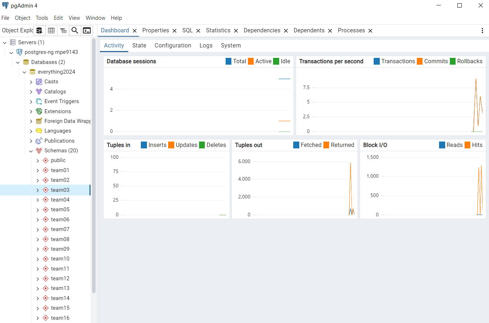
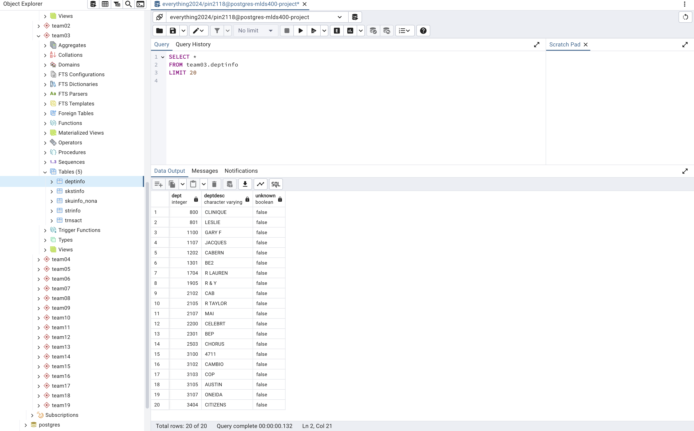
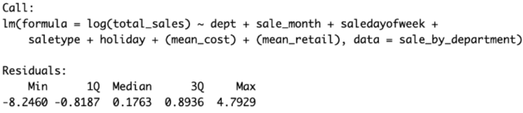
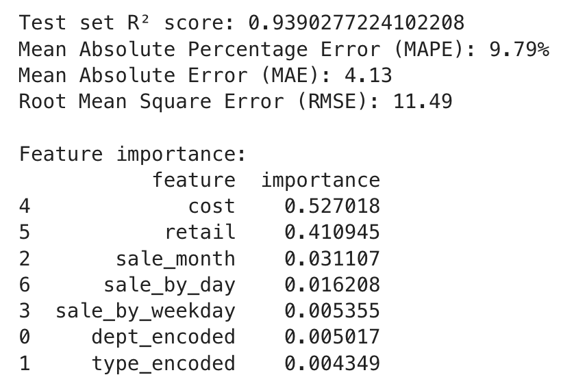

# MLDS_400_2024_Team03 Progress Update 
## Week 2
    - We saw the 5 csv files through SSH and connect with the pgAdmin server 
    - We review the database schema and come up with a tentative problem statement. 


### Problem Statement:
Predict sales for products across various store locations (city, state, zip) and seasons to estimate price and revenue for Dillards. We hypothesize that factors such as discount, seasonal demand, and wealth of the location (zip code) significantly influence sales performance.
#### 1. Objective:
- Analyze trend in revenue of store with respect to multiple factors.
- Determine revenue of different stores using Machine learning model.
#### 2. Key Factors:
- Retail price
- Seasonal demand
- Location (wealth by zip code)

#### 3. Data Sources:
- Product sales data by location and time
- Wealth indicators by zip code (imported externally online)

#### 4. Goal: 
Predict the sale for different department across seasons and locations to potentially give insight for inventory prediction and sale improvement for different department.


## Week 3
    - Get access to the databases.
    - Clean the database and clarify the column name of each table 
    - Load the csv files into Postgres Server, ready for query.
    - Start EDA with R/Python to explore the data for interesting features


## Week 4
    - Filtered out store that do not have stock or transact which could be out of business
    - Filtered out sku that not in trnsact and stock infomation
    - Clean N/A value in trnsact to make the data posible for processing 
    - Clean some typo issue in the entry of price and retail 
        ```{r}
        skstinfo_cleaned[skstinfo_cleaned$cost == 123.36,'cost'] = 1/10*skstinfo_cleaned[skstinfo_cleaned$cost == 123.36,'cost']
        skstinfo_cleaned[skstinfo_cleaned$retail == 440.00,'retail'] = 1/10*skstinfo_cleaned[skstinfo_cleaned$retail == 440.00,'retail']
        skstinfo_cleaned
        summary(skstinfo_cleaned)
        ```

## Week 5
    - Cleaned Trnsact, Strinfo, Skstinfo, merged three datasets.
    - Kept Stores and products that only appear in all three datasets
    - Filtered out Month, Day, Days of the week from saledate column (We only have years from 2005 and 2006)
    - Generated plots and table on the distribution of sells (Time and location)
    - Currently deciding on the type of machine learning model we want to apply (Maybe Unsupervised learning)

## Week 6
    - Conduct EDA to explore trend in sale between years, seasons, store/city, and departments
    - Brain storm for ML model and narrow down the scope of the project 
    -> Predict top-sale products in 10 most popular departments during each season with respect to retail price, discount, product category, and location. 

## Week 7
    - Try fitting ML model to predict sale by department over months (season)
    - Review the fit of the model by summary, the residual, and qq plot
    - Try fitting the predicting model for each product to predict sale with respect to more factors such as discount rate and location 


## Week 8
    - Analyze the predictive ML model to predict sale by department over months (season)
    - Review the coefficient of each predictors and draw insight about department sale with respecto to cost, retail price, and month.

## Week 9
    - Fitted A Random Forest Model on Python to predict sale by department over date. 
    - Specifically, weekday, day of the month, months are extracted from the model. We may want to extract some additional information, such as holiday or not.
    - The Department and sale type variable are treated as categorical variable. Both Label Encoding and One-hot Encoding are experimented. 
    - The data was splited into Train and Test set, and we use GridSearchCV package to perform a cross validation on the train data.
    - We train the test data based on the best parameter on the train data from our Cross Validation Result.
    - The score we use to evaluate is negative mean squared error, since in GridSearchCV, the larger the better result.
    - The Model was trained with the following set of parameters:
    - param_grid = {
        'n_estimators': [100, 200, 300],
        'max_depth': [10, 20, None],
        'min_samples_split': [2, 5, 10],
        'min_samples_leaf': [1, 2, 4, 8],
        'max_features': ['sqrt', 'log2', None]
        }
    - Our next step is to extract more information other than department. 
    - The cost and retail is calculate as a mean of each Department's cost and retail


## Week 10
    - Focused on hyperparameter tuning to further improve the Random Forest model's performance.
    - Experimented with advanced tuning techniques using Optuna and manual grid search.
    - Included additional features in the model, such as holiday indicators, and engineered new variables from the data (e.g., sales density per square footage).
    - Evaluated the performance using RMSE and R2 scores on the test set to identify the best parameter combination.
    - Used visualization tools (e.g., feature importance plots) to interpret the impact of tuned parameters on predictions.
    - Began integrating ensemble methods (e.g., stacking or boosting) to compare results with the current Random Forest model.
